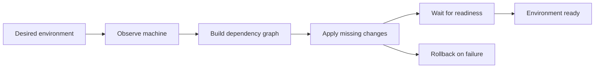

<h1 align="center">Workstate</h1>

<p align="center">
  <strong>⚡ One command. Your entire work environment, orchestrated.</strong>
</p>

<p align="center">
  Workstate turns a declarative environment into a ready-to-use workspace — opening your projects,
  arranging your desktop, starting services, waiting for them to be ready, and cleaning up safely.
</p>

<p align="center">
  <a href="#-quick-start">Quick Start</a> •
  <a href="#-why-workstate">Why Workstate?</a> •
  <a href="#-features">Features</a> •
  <a href="#-commands">Commands</a> •
  <a href="#-support">Support</a>
</p>

---

## ✨ What is Workstate?

Workstate is a local work-environment orchestrator for people who want to start
working instead of rebuilding their setup every morning.

Define an environment once. Workstate remembers the applications, projects,
desktop workspaces, terminal sessions, commands, containers, emulators and
dependencies that belong to it. Then run the environment whenever you need it:

```bash
workstate my-project
```

Workstate observes what is already running, applies only what is missing, waits
for required services to become ready, remembers what it owns, and leaves your
machine safe when something fails or when you stop the environment.

It is not a collection of shell commands. It is a state-aware, declarative
control plane for your local workflow.

## ⚡ Quick Start

### 1. Install

On a supported Linux system:

```bash
curl -fsSL https://tryws.theryston.dev/unix.sh | bash
```

Verify the installation:

```bash
workstate --version
```

### 2. Create an environment

Give your workflow a name and open the interactive editor:

```bash
workstate new my-project
```

From the editor, add the actions your workflow needs:

- open a project in Zed, VS Code or Cursor;
- open any installed desktop application;
- run a command once or keep it running in
  [tmux](https://github.com/tmux/tmux/wiki);
- start a Docker container or Docker Compose project;
- start an Android Emulator device;
- select or create a COSMIC workspace;
- enable or preserve tiling;
- add dependencies and readiness checks.
- and much more!

Save the environment when it looks right.

### 3. Launch the whole workflow

```bash
workstate my-project
```

Independent actions run concurrently. Dependent actions wait for their
prerequisites. Background commands continue in a persistent
[tmux](https://github.com/tmux/tmux/wiki) session after Workstate exits.

### 4. Stop safely

```bash
workstate stop my-project
```

Workstate cleans up resources owned by the environment and preserves resources
that already existed or are shared with another environment.

That is the complete loop:

```text
Create once  →  Run on demand  →  Work  →  Stop safely
```

## 💡 Why Workstate?

Most workspace launchers execute a list of commands and hope the machine is in
the expected state. Workstate treats your workflow as a desired state and
reconciles it with reality.

| Traditional scripts                      | Workstate                                      |
| ---------------------------------------- | ---------------------------------------------- |
| Start everything again                   | Reuse what is already correct                  |
| Duplicate windows and processes          | Stable resource identity                       |
| Stop anything that looks related         | Stop only resources the environment owns       |
| Fail halfway and leave a broken setup    | Roll back completed changes                    |
| Sleep for an arbitrary number of seconds | Wait for real readiness conditions             |
| Hard-code one linear sequence            | Build and schedule a dependency graph          |
| Configure only the terminal              | Coordinate desktop, apps, services and devices |

### The reconciliation loop



The result is a workflow that is repeatable without being destructive.

## 🚀 Features

### Declarative environments

Create named environments instead of maintaining a pile of unrelated scripts.
Each environment is persisted as readable TOML under:

```text
~/.workstate/<environment>/environment.toml
```

The interactive editor handles creation, validation, action configuration,
workspace selection and path completion. You can keep the configuration simple
or inspect and edit the generated TOML directly.

### Desktop-aware workflows

Workstate understands that your work environment is more than a terminal:

- create, select and target desktop workspaces;
- discover existing workspaces and link them to an environment;
- open and move application windows into the right workspace;
- configure tiling per workspace;
- preserve previous desktop state during cleanup;
- open projects in Zed, VS Code or Cursor;
- discover installed applications for custom application actions.

### Persistent terminal sessions

Run long-lived commands without keeping the main Workstate process attached:

- one persistent tmux session per environment;
- one tmux window per background command;
- working directory and environment variables per command;
- run-once commands for migrations, setup tasks and scripts;
- background processes that survive after Workstate exits.

Attach to a running environment whenever you want:

```bash
tmux attach-session -t workstate-my-project
```

### Docker without the startup dance

Docker actions understand the difference between an available engine, Docker
Desktop, a rootless service and a container that is merely present but stopped.
Workstate can:

- detect and reuse an already-ready Docker endpoint;
- start Docker Desktop or the required local service when needed;
- start and inspect individual containers;
- configure images, commands, environment variables, mounts and ports;
- start Docker Compose projects and selected services;
- wait for container and Compose readiness;
- stop or remove only resources the environment owns.

### Android development support

Add an Android Emulator action, choose an available AVD from the editor and let
Workstate coordinate the emulator and `adb` state. Readiness is checked instead
of assuming that a process launch means the device is usable.

### Dependency-aware execution

Every action can depend on other actions. Workstate validates the graph, rejects
cycles and invalid references, then schedules independent actions concurrently.
For example:

```text
Docker engine  ──┬──> API container  ──> API health check
                 └──> Database       ──> Migration command
Project editor  ───────────────────────────────┘
```

### Safety by design

Workstate records ownership for every resource it observes or creates:

- created during this run;
- created by this environment previously;
- reused from an existing resource;
- shared with another active environment;
- unknown or externally owned.

Rollback and `stop` respect those records. A resource is never closed or deleted
simply because it happens to be visible.

### Automation-friendly output

The interactive experience is designed for humans, while the CLI remains easy to
automate:

```bash
workstate my-project --dry-run
workstate my-project --json
workstate my-project --quiet
workstate my-project --verbose
```

Use `--no-color` for plain terminal output, `--yes` to skip destructive
confirmations in automation, and `--config PATH` to use an alternate Workstate
data directory.

## 🧩 Supported action types

| Action                      | What it does                                       |
| --------------------------- | -------------------------------------------------- |
| `open_project`              | Open a project in Zed                              |
| `open_project_with_vs_code` | Open a project in VS Code                          |
| `open_project_with_cursor`  | Open a project in Cursor                           |
| `open_application`          | Open an installed desktop application              |
| `run_command`               | Run a command once or in a persistent tmux session |
| `configure_tiling`          | Enable, disable or preserve tiling for a workspace |
| `start_container`           | Ensure a Docker container exists and is running    |
| `start_compose`             | Ensure a Docker Compose project is running         |
| `start_android_emulator`    | Start and verify an Android Virtual Device         |

Actions can target a desktop workspace, depend on other actions, define working
directories and environment variables, and include readiness checks.

## 📝 Example configuration

You normally create this through `workstate new`, but the generated file is
plain TOML and remains transparent:

```toml
schema_version = 1
name = "Personal API"
slug = "personal-api"

[[workspaces]]
id = "development"
name = "Development"
tiling = "enabled"

[workspaces.target.create]
name = "Development"

[[actions]]
id = "api"
kind = "run_command"
working_directory = "$HOME/Projects/personal-api"
desktop_workspace = "development"
execution_mode = "background"

[actions.parameters.command]
program = "bun"
arguments = ["run", "dev"]

[[actions.readiness_checks]]
type = "tcp"
host = "127.0.0.1"
port = 3000

[actions.readiness_checks.timeout]
milliseconds = 30000

[[actions]]
id = "editor"
kind = "open_project"
desktop_workspace = "development"
depends_on = ["api"]

[actions.parameters]
application = "zed"
project_path = "$HOME/Projects/personal-api"
```

The editor validates the configuration before saving it. Paths support both `~`
and `$HOME` forms and are resolved safely at runtime.

## 🛠️ Commands

| Command                          | Purpose                             |
| -------------------------------- | ----------------------------------- |
| `workstate`                      | Select an environment interactively |
| `workstate <environment>`        | Reconcile and run an environment    |
| `workstate new [environment]`    | Create an environment in the editor |
| `workstate edit [environment]`   | Edit an existing environment        |
| `workstate stop [environment]`   | Stop owned resources safely         |
| `workstate delete [environment]` | Stop and delete an environment      |
| `workstate --help`               | Show command help                   |
| `workstate --version`            | Show the installed version          |

The `run` and `start` forms are accepted as hidden compatibility aliases:

```bash
workstate run my-project
workstate start my-project
```

### Global flags

| Flag            | Purpose                                    |
| --------------- | ------------------------------------------ |
| `--dry-run`     | Show what would change without applying it |
| `--json`        | Emit machine-readable output               |
| `--quiet`       | Suppress non-error output                  |
| `--verbose`     | Show detailed diagnostics                  |
| `--no-color`    | Disable terminal colors                    |
| `--yes`         | Skip destructive confirmations             |
| `--config PATH` | Use a custom Workstate data directory      |

## ✅ Support

Workstate detects your platform and available integrations before doing any
work. The current supported profile is intentionally focused so the first
experience can be deeply integrated instead of merely generic.

| Platform                                | Status             |
| --------------------------------------- | ------------------ |
| **Pop!\_OS + COSMIC + tmux**            | ✅ Supported today |
| **GNOME + any Linux distribution**      | 🚧 Coming soon     |
| **KDE Plasma + any Linux distribution** | 🚧 Coming soon     |

### Current requirements (auto installed by the installer)

- `tmux` available on `PATH`;
- `curl` for the installer.

### Optional integrations

Install only what your environment uses:

- Zed, VS Code or Cursor for project actions;
- Docker Engine, Docker Desktop or Docker Compose for container actions;
- Android SDK Emulator and `adb` for Android actions.

If an optional capability is missing, Workstate reports it during preflight
instead of failing later with an opaque command error.

## 🗺️ Roadmap

The first supported profile is Pop!_OS + COSMIC. The next platform expansion is
planned around the same capability model:

- GNOME support across Linux distributions;
- KDE Plasma support across Linux distributions;
- additional desktop and terminal backends;
- broader cross-platform support as integrations mature.

The goal is not to make every platform behave identically. The goal is to give
each platform a first-class backend while preserving the same environment model,
safety guarantees and one-command workflow.

## 🤝 Contributing

The repository contains the engineering guide and implementation tasks that
define the domain boundaries, safety rules and support profile. Before opening a
change, read:

- [`AGENTS.md`](AGENTS.md) — product and engineering contract;
- [`CHANGELOG.md`](CHANGELOG.md) — recent behavior changes.

For local development:

```bash
cargo fmt --check
cargo test
cargo clippy --all-targets --all-features -- -D warnings
```

## 📄 License

Workstate is currently in active development. License information will be
published with the first stable release.

---

<p align="center">
  <strong>Stop rebuilding your workspace. Start working.</strong>
</p>
